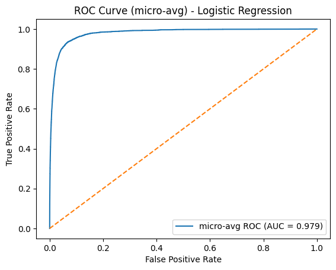
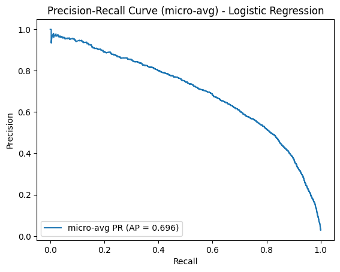

Gale Dela Cruz, Leila Groves 

# Book Genre Classifier
### Research Question: Can we use textual data (user reviews, author about, etc.) to classify a book's genre?

#### Purpose: Understanding the relationship between textual data (user reviews, book descriptions, and author biographies) and book genres

### Brief Overview
The primary issue we are addressing involves large-scale book libraries that could be unreliable or incomplete when it comes to genre labeling. As a result, this could harm book searches, discovery, and lead to costly manual inputs. Our model aims to automatically assign genre labels to books in libraries with sparse or missing metadata; utilizing textual signals from reviews, book descriptions, and author biographies. 

## Addressing  Limitations
One of the main limitations was **Class Imbalance**. A small number of genres dominate the dataset while others appear infrequently. This skews the classifier toward predicting high-frequency genres, which inflates performance on common categories and suppresses accuracy on underrepresented ones. Our **SBERT embeddings** provide rich semantic information, but they also make the model sensitive to noisy, repetitive, or low-quality text. Another limitation we had was **data leakage**. To prevent target leakage—particularly cases where genre names appeared directly in the review text—we removed genre-specific terms during preprocessing and filtered out books with missing or unreliable category labels, ensuring the model did not learn the target from explicit cues.

## Understanding the Features 
Our exploratory visualizations were created to identify any potential features for our model. To establish a foundational understanding, we started with a visualization of **Genre Distribution by Review Count** by both genre structures; Category 2 (broad genres) and Category 3 (subgenres).  

**Genre Distribution** Review activity is highly concentrated in a few fictional genres such as **Literature & Fiction**, **Mystery/Thriller**, and **Children's Books**. However, Non-fiction genres appear far less frequently. This gave insight into the class imbalance issue the model will have to address. Moreover, it also meant review-based features (ex. sentiment score) will disproportionately shaped by fiction-heavy categories. Category Level 3 displays a similar pattern with dominant narrative genres. Although category level 3 provided useful granular data, we ultimately stuck with the broader category for the model to reduce complexity and high dimensionality. 

### Behavioral Signals 
**Sentiment Score as a Potential Signal** 
Afterwards, we examined whether the emotional tone of reviews differed accross genres. From the chart below, it displays genres such as Self Help and Children's Books skew strongly positive, while Politics & Social Sciences shows a more polarized sentiment. **Although these differences are not large enough to determine genre on their own, sentiment score served as a good behavioral auxiliary feature** 

**Note: A more detailed subgenre breakdown of sentiment scores is available in assets**

When combining sentiment scores and average user ratings, they provided lightweight behavioral signals by complementing text-based features by capturing how readers perceived books overall. 

### SBERT Embeddings
To understand whether review wording or author words reflected genre themes, we looked at common vocabulary for three genres with contrasting sentiment scores.  

- Self-Help emphasizes emotional growth (life, love, great).
- Romance highlights character-driven storytelling (love, story, character)
- Politics & Social Sciences uses analytical terminology (people, world, government)

These differences supported the use of semantic text features; however, most importantly, they highlighted the significant leakage risks in reviews and author biographies. 

With these findings, we decided to use SBERT embeddings generated from three text sources:
1. Concatenated review text
2. Book Descriptions 
3. Author Biography 

Altogether, these features created a unified semantic feature space for each book.

## Model Performance Analysis
| Classifier| Accuracy | Precision | Recall | F1-Score|
|:----------| :------: | :-------: | :----: |-------: |
| Dummy Classifier (Most Frequent) | 0.260859 |0.068047 |0.260859 |0.107938 |
| XGBoost (hist) | 0.626263  | 0.627426 |0.626263  |0.608448 |
| Logistic Regression | 0.644697 |  0.637163| 0.644697 | 0.632771|

We are satisfied with our Logistic Regression model’s F1-score of 63%, especially considering that an earlier version of our model appeared to achieve an F1-score of nearly 80%. Upon further investigation, we discovered that this higher performance was due to data leakage—specifically, genre-related terms appearing in the input text—which artificially inflated the results. After removing genre-specific tokens and improving our preprocessing pipeline, the model’s performance dropped to a more realistic and trustworthy level. This reinforces that our current 63% F1-score reflects genuine predictive ability rather than leakage-driven overfitting.

The micro-averaged ROC curve shows excellent discriminative performance, with an AUC of 0.979, indicating that the model is highly effective at separating correct from incorrect genre predictions across all classes. Even in a multi-class setting, the curve stays close to the top-left corner, suggesting strong ranking ability and low false-positive rates. The micro-averaged Precision–Recall curve, with an average precision of 0.696, reflects more realistic performance under class imbalance. Precision gradually decreases as recall increase showing that while the model excels at identifying confident positive cases, performance becomes noisier as it attempts to retrieve all instances, especially minority genres.

The confusion matrix shows that the model performs strongly on the top five genres, with high accuracy for dominant categories like Literature & Fiction and Mystery, Thriller & Suspense. Distinct genres such as Children’s Books are classified especially well, reflecting clear semantic separation in their text. Most misclassifications occur between closely related narrative genres—such as Literature & Fiction and Mystery/Thriller—where thematic and linguistic overlap is expected. Smaller non-fiction genres, like Christian Books & Bibles and Biographies & Memoirs, show moderate confusion, largely due to their lower representation and broader vocabulary. Overall, the matrix confirms that the model captures genre-specific patterns effectively while primarily struggling in areas of natural semantic overlap.
## 

Conclusion

In summary, our work demonstrates that textual signals—from reviews to author biographies—can reliably support automated genre classification. This classifier reduces dependence on incomplete metadata and streamlines catalog management at scale. Moving forward, integrating this system into real-world library or retail pipelines can greatly enhance book discovery and user experience.

## References 
[Amazon Books Dataset (20k Books + 727k reviews)](https://www.kaggle.com/datasets/hadifariborzi/amazon-books-dataset-20k-books-727k-reviews/data) published by Hadi Fariborzi (Licensed under MIT) 