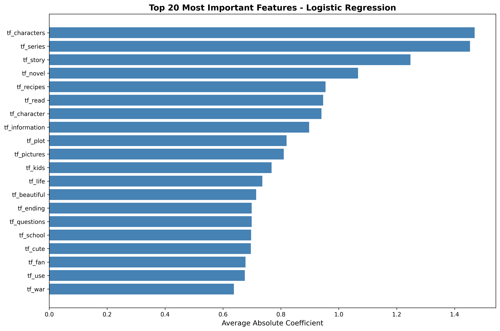

Gale Dela Cruz, Leila Groves

### Your labeling logic and how you avoided leakage.
This is a multiclassification model, so our main target label was the genre label. To avoid leakage, we had to make sure that none of those words in the genres we were going to predict were going to be present in any text we were going to use. 

### What features and models you used, and why.
We decided on leaning towards Logistic Regression because from our EDA findings, we knew that different genres have distinct sentiment patterns (Self-Help is consistently positive, Politics is polarized, etc.). Therefore, sentiment distributions vary systematically by genre and word usage patterns are genre-specific (e.g., "love" in Romance, "government" in Politics). We noted that these are possibly linear separable patterns that Logistic Regression excels at capturing compared to other models. It's also important to consider that TF-IDF creates sparse, high-dimensional features, especially with 300 features. So, Logistic Regression handles sparse data well through L1 regularization and it can learn additive effects (e.g., "love" + "story" + "character" = Romance). When compared to other models we tested like Random Forest and Gradient Boosting, they did not perform as well when considering those features. Especially Random Forest, it relied too much on the sentiment score and the tradeoff is that it ignored rich TF-IDF vocabulary. 

Classifier                      | Accuracy | Precision | Recall | F1-Score   
Dummy Classifier:                  0.217397   | 0.047262   | 0.217397  | 0.077644  
Logistic Regression:               0.377535   | 0.343242   | 0.377535  | 0.322334  
Random Forest:                     0.326037   | 0.317974   | 0.326037  | 0.248212   
Gradient Boosting:                 0.331359   | 0.304714   | 0.331359  | 0.293628

Logistic Regression used full vocabulary (top 20 features were TF-IDF terms, sentiment ranked 146th). The plot below shows the top 20 most influential TF-IDF features:

**Features Explored in the first Draft**
1. Sentiment Score
2. TF-IDF on review text 

Those worked well in the first round resulting in a weighted f1 score of around 0.37. We tested a few more features such as using the `is_verified` column and other engineered features like 'exclamation_count', 'question_count', 'caps_ratio'. Ultimately, I removed them because `is_verified` did not weigh much in feature importance and those engineered features seemed redundant with sentiment scores. 

### Strengths and weaknesses of the baseline.

**Strengths:**
1. **Simplicity and Interpretability**: Uses only two feature types (sentiment + TF-IDF), making the model easy to understand and maintain.

2. **Strong TF-IDF Performance**: Top 20 features are all TF-IDF terms (e.g., "characters", "series", "story", "novel"), showing that genre-specific vocabulary is highly predictive. This validates our EDA findings about distinct word patterns per genre.

3. **Sentiment as Secondary Signal**: Sentiment_score (coefficient 0.290, ranked 253rd) provides complementary information without dominating predictions. This aligns with our EDA observation that genres like Self-Help are consistently positive while Politics is polarized.

4. **Handles Imbalanced Data**: Weighted F1-score of 0.322 significantly outperforms the dummy classifier (0.078), demonstrating genuine predictive power despite heavy class imbalance (Literature & Fiction: 21.7% of samples).

5. **Computational Efficiency**: Logistic Regression trains quickly on 50,000 samples with 302 features, making it scalable for production use.

6. **Low Overfitting Risk**: Minimal feature set reduces risk of memorizing training data, as evidenced by testing multiple feature combinations (user_rating, review_length, etc.) which all performed worse.

**Weaknesses:**
1. **Moderate Absolute Performance**: F1-score of 0.322 means the model is only correct ~32% of the time across all genres. 

2. **Struggles with Similar Genres**: Genres with overlapping vocabulary (e.g., "Mystery & Thriller" vs. "Literature & Fiction") are difficult to distinguish using only text features. The model may confuse literary thrillers with general fiction.

3. **Genre Imbalance Impact**: With Literature & Fiction dominating (21.7% of data), the model may be biased toward predicting popular genres. Rare genres with <10 samples were filtered out entirely, limiting applicability.

4. **Limited Context Understanding**: TF-IDF captures word frequency but misses semantic meaning. Phrases like "plot twist" (positive in Thriller, neutral in other genres) are treated as separate unigrams/bigrams rather than context-dependent expressions.

5. **Review Text Bias**: The model predicts genre based on *how people review* books, not the book content itself. Reviews may discuss writing style, enjoyment, or personal experience rather than genre-defining elements (e.g., a Romance review might focus on "characters" and "story" without mentioning "love").

6. **Data Leakage Risk**: Despite filtering genre words from review text, some leakage may remain. For example, reviewers might describe a "romantic story" without using the exact word "romance", but the model still picks up on correlates like "love", "relationship", "heart" (coefficients 0.61, 0.48, 0.49 respectively).

7. **No Metadata Utilization**: The model ignores potentially useful metadata like book price, publication date, author popularity, or page count, which could provide additional genre signals.

8. **Convergence Issues**: Initial feature engineering attempts (adding user_rating, review_length, etc.) caused convergence warnings and degraded performance (F1: 0.322 → 0.272), suggesting the model is sensitive to feature scaling and multicollinearity.

### How you validated and evaluated performance.

- We evaluated the performance based on comparing it to the f1 score because it handles heavily imbalanced data. To better understand class-level behavior beyond F1, we also examined Precision–Recall curves and ROC curves for the top five genres.

The Precision–Recall curves highlight how well the model retrieves the correct genre labels under class imbalance. Children’s Books, Mystery/Thriller, and Literature & Fiction maintain relatively high precision at moderate recall levels, indicating they are easier for the model to identify. In contrast, genres like Teen & Young Adult and Biographies & Memoirs show steep drops in precision, meaning the model frequently confuses them with other genres. The average precision (AP) values reflect this gap: Children’s Books has the highest AP (0.611), while Teen & Young Adult and Biographies score below 0.20. This confirms that the model performs best on genres with more distinct vocabulary and more abundant data.

The ROC curves evaluate how well the model separates each genre from all others. Children’s Books again performs the best with an AUC of 0.864, followed by Mystery/Thriller and Biographies & Memoirs. Even the lowest-performing genre (Teen & Young Adult, AUC 0.750) is still well above the random baseline (0.5), which shows the classifier is learning meaningful signal despite noise and imbalance. The strong ROC performance across the board suggests that while the model can rank genre probabilities effectively, the main limitations arise at the decision threshold stage—where precision and recall trade-offs become more pronounced.

### Possible reasons for errors or bias.

1. **Significant genre imbalance.** A small number of genres dominate the dataset while others appear infrequently. This skews the classifier toward predicting high-frequency genres, which inflates performance on common categories and suppresses accuracy on underrepresented ones. The confusion matrix reflects this imbalance through strong diagonal signals for majority genres and diffuse errors for minority genres.

2. **Textual leakage from explicit genre mentions.** Many reviews directly state the genre (e.g., “I love dystopian sci-fi”), which can cause the model to rely on keyword shortcuts rather than deeper semantic cues. When this leakage exists in both train and test splits, the model’s measured performance can appear artificially high.

3. **Blurry or multi-genre boundaries.** Many books sit at the intersection of genres (e.g., fantasy + romance, thriller + historical). Labels typically force a single category even when the text legitimately supports multiple interpretations. This creates cases where the model’s “errors” are actually plausible alternative labels.

4. **Inconsistent review length and clarity.** Some reviews are long and descriptive while others are short or vague. Sparse reviews carry weak genre signals, increasing prediction variance and making minority genres especially difficult to classify.

### What worked well and what didn’t
**What Worked Well:**
1. **Feature Simplicity**: After testing 10+ engineered features (review_length, user_rating, book_avg_rating, exclamation_count, etc.), we found that **sentiment_score + TF-IDF alone** achieved the best F1-score (0.322). Adding more features consistently hurt performance:
   - Sentiment + TF-IDF: **F1 = 0.3223** 
   - + user_rating: F1 = 0.3219 (↓0.04%)
   - + all features: F1 = 0.2766 (↓14%)
   
   **Explanation**: TF-IDF already captures the most predictive signal (genre-specific vocabulary). Additional features introduced noise and overfitting.

2. **TF-IDF Dominance Validates EDA**: Our word clouds and frequency analysis predicted that words like "love" (Romance), "war" (History), and "god" (Religion) would be genre-specific. The model confirmed this—all top 20 features are TF-IDF terms with coefficients >0.6.

3. **Bigrams Improved Signal**: Including bigrams (e.g., "year old", "ve read", "good read") in TF-IDF helped capture multi-word genre markers that unigrams missed.

4. **Sentiment as Weak Complement**: Sentiment_score (coef 0.290, ranked 253/302) adds minimal value, suggesting genre classification is more about *what* is said (vocabulary) than *how* it's said (tone). This contradicts our initial EDA hypothesis that polarized sentiment would strongly indicate genres like Politics.

**What Didn't Work:**
1. **Behavioral Features Failed**: user_rating (coef 0.164, ranked 302/302) was the weakest predictor. Ratings are genre-agnostic—readers give 5 stars to books they love regardless of genre.

2. **Review Length Features Were Redundant**: review_length, review_char_length, and avg_word_length added no value and caused multicollinearity. Genre is determined by content, not verbosity.

3. **Book-Level Aggregation Hurt Performance**: Aggregating sentiment statistics (sentiment_mean, sentiment_std) per book caused 8,582 NaN rows and alignment issues during feature engineering.

4. **Class Balancing Backfired**: Using `class_weight='balanced'` in Logistic Regression dropped F1 from 0.322 → 0.218 (↓32%). The model over-predicted rare genres, sacrificing overall accuracy for per-class fairness.
As shown below, performance varies widely across genres, largely driven by class imbalance:

### NEXT STEPS: Ideas for final report (e.g., new features, different algorithms, hyperparameter tuning).
1. **More Text Features:** Play around with other text columns that provide the book descriptions and then try to refine the way we clean our text
2. **Hyperparameter Tuning**: Test different TF-IDF configurations (max_features: 500-1000, min_df: 3-5, max_df: 0.8-0.9) and Logistic Regression regularization strengths (C: 0.1-10).
3. We can try more advanced text models like Test transformer-based embeddings (BERT, RoBERTa) to capture semantic meaning beyond TF-IDF bag-of-words. This could help distinguish similar genres (Thriller vs. Mystery).
4. We could also combine Logistic Regression (handles TF-IDF well) with a neural network (captures non-linear patterns) using stacking or voting.
5. Currently, we are only relying on the broad category. It's important to consider the possibility of a two-stage model:
   - Stage 1: Predict broad category (Fiction vs. Non-Fiction)
   - Stage 2: Predict sub-genre within category
This could improve accuracy by reducing confusion between dissimilar genres.
6. **Address Class Imbalance with SMOTE**: We can try using synthetic minority oversampling instead of class weights to balance genre distribution without sacrificing overall performance.
   
