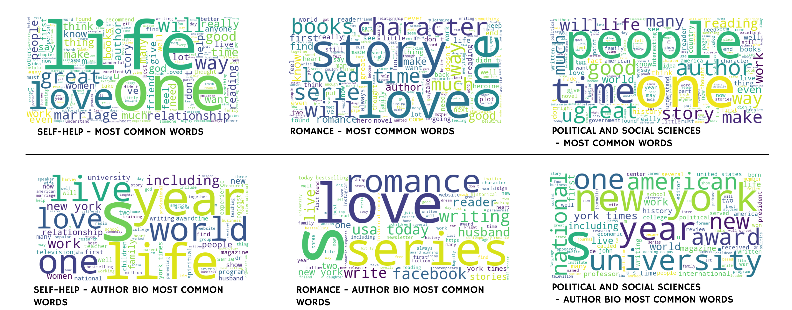

Gale Dela Cruz, Leila Groves
## Book Genre Classifier
#### Purpose: Understanding the relationship between user reviews and book genre  

Research Question:
1. Can we use textual data (user reviews, author about, etc.) to classify a book's genre?
2. Can we predict a book's ending based on customer reviews that include spoilers? (Stretch Goal)

### Our Dataset and Why We Chose It
The dataset we chose is [Amazon Books Dataset (20k Books + 727k reviews)](https://www.kaggle.com/datasets/hadifariborzi/amazon-books-dataset-20k-books-727k-reviews/data) published by Hadi Fariborzi (Licensed under MIT) on Kaggle. This is the ideal dataset for now because it's manageable and achieves the goal of our first question. It could also provide insight into our stretch goal question, especially if user reviews include spoilers. If we have more time to explore our second question, we could examine whether a book's genre influences its ending.

**Structure:**
- **Format:** Merged CSV containing book metadata + user reviews (originally 2 separate files)
- **Dimensions:** 41 columns spanning text, numerical, categorical, and metadata features

    

    
<b>Full Column List (Click to expand)</b>

    **Text Features (string):**
    - `text` - Review content (primary predictor)
    - `review_title` - Review headline
    - `description` - Book description
    - `features_text` - Book features/highlights
    - `author_about` - Author biography

    **Target Variables (categorical string):**
    - `category_level_2_sub` - Sub-genre classification
    - `category_level_3_detail` - Detailed genre classification
    - `main_category` - Broad category
    - `category_level_1_main` - Main category level

    **Numerical Features:**
    - `rating` - Individual review rating (integer, 1-5 stars)
    - `average_rating` - Book's average rating (float, 1.0-5.0)
    - `rating_number` - Total number of ratings (integer count)
    - `helpful_vote` - Helpfulness votes for review (integer count)
    - `page_count` - Number of pages (integer)
    - `price_numeric` - Book price (float, USD $)
    - `sentiment_score` - Computed sentiment score (float, -1.0 to 1.0)
    - `year` - Review year (integer, YYYY)

    **Categorical Features (string):**
    - `book_title` - Book title
    - `subtitle` - Book subtitle
    - `author_name` - Author name
    - `publisher` - Publisher name
    - `format` - Book format (e.g., "Hardcover", "Paperback", "Kindle")
    - `language` - Book language (e.g., "English", "Spanish")
    - `verified_purchase` - Whether the purchase was verified (boolean: True/False)

    **Identifiers & Metadata:**
    - `asin` - Amazon Standard Identification Number (string)
    - `parent_asin_x`, `parent_asin_y` - Parent product identifiers (string)
    - `user_id` - Reviewer ID (string)
    - `isbn_10` - ISBN-10 number (string, 10 digits)
    - `isbn_13` - ISBN-13 number (string, 13 digits)
    - `timestamp` - Unix timestamp (integer, seconds since epoch)
    - `date` - Review date (datetime string, YYYY-MM-DD)
    - `publisher_date` - Publication date (datetime string)

    **Additional Features:**
    - `images_x`, `images_y` - Image URLs (string, comma-separated URLs)
    - `videos` - Video URLs (string, comma-separated URLs)
    - `dimensions` - Book dimensions (string, e.g., "8 x 5.5 x 1.2 inches")
    - `item_weight` - Book weight (string, e.g., "1.2 pounds" or "545 grams")
    - `store` - Store information (string)
    - `bought_together` - Related products (string, comma-separated ASINs)

    

- **Organization:** Each row represents one review linked to book metadata via `asin` (Amazon Standard Identification Number)
- **Target Hierarchy:** Two-level genre classification system (`category_level_2_sub` → `category_level_3_detail`)

**Relevance:** This dataset is ideal for text classification as it provides rich textual data (user reviews and publisher descriptions) paired with hierarchical genre labels. Allowing us to primarily explore how user reviews (user-generated content) correlate with genre classification.

### What did you learn from your EDA?
### Summary of key variables, data volume, missingness, and potential target or interaction signals.

We explored two datasets: book metadata and customer reviews.
Key variables from the metadata include title, author_name, and the hierarchical genre tags `category_level_2` and `category_level_3`. Category level 2 represents broader genres, while level 3 provides more granular genre descriptions. Category level 2 is missing data for less than 1% of records, and level 3 is missing less than 2%. The metadata covers approximately 20,000 distinct book titles.
From the reviews dataset, key variables include the rating, title, and text fields. The title is a short review summary, while the text contains the full written review. The dataset contains 727,876 reviews, with virtually no missing ratings and less than 1% missing review text or titles. However, we observed some duplicate reviews that may need to be filtered or deduplicated before modeling.
**Potential predictive signals come from behavioral features (such as review frequency and rating distributions) and textual sentiment extracted from the review text. Since our goal is to predict a book’s genre from customer reviews, these linguistic and emotional cues are particularly relevant for identifying relationships between language use and genre characteristics.**

### Visualizations
The initial goal of our visualizations is to identify any potential features for our model. To establish a foundational understanding, we started with a simple visualization of **Genre Distribution by Review Count**. It's important to note that book genres in our dataset are organized hierarchically rather than being independent categories. This means **Category Level 2** represents broader genre groups, while **Category Level 3** provides more granular data, acting as subgenre distinctions within those groups.

The **Category Level 2** chart displays the overall distribution of reviews across major genres. As we can see, it's a highly skewed distribution, where a small number of fiction-related genres dominate the dataset. This includes **Literature & Fiction** leads by a large margin, followed by **Mystery, Thriller & Suspense** and then, **Children's Books**. Other genres, such as Biographies & Memoirs, Christian Books & Bibles, and Teen & Young Adult follow, while non-fiction genres like Politics & Social Sciences or Business & Money have much smaller representation. The imbalance highlights that fictional genres drive the majority of reader engagement. **This suggests that patterns in sentiment (will discuss further) and review behavior will be disproportionately influenced by fiction-related categories.**

**Category Level 3** provides a deeper breakdown of the same data by subgenre. At this level, **Genre Fiction**, **Thrillers & Suspense**, and **Literature & Fiction** remain dominant, reinforcing the strong preference for narrative-driven content.
Other active subgenres include Action & Adventure, Science Fiction & Fantasy, Contemporary, and Women’s Fiction, which together reflect a diverse but fiction-heavy readership.
Beyond fiction, smaller subgenres like Christian Living, Politics & Government, and History & Criticism represent specialized interest areas with fewer reviews but potentially higher variation in reader sentiment. **While most reviews cluster in mainstream fiction categories, those niche subgenres still contribute variety, largely adding diversity and may introduce valuable sentiment variability**

Overall, the reviews are heavily concentrated in fiction, particularly in mainstream narrative genres. These dominant categories shape overall sentiment trends, while niche non-fiction and specialized subgenres, despite lower volume, could exhibit greater sentiment diversity. Understanding this imbalance helps contextualize later findings and informs how genre-related features could enhance model performance.

We mentioned a lot about sentiment analysis previously, and that's primarily driven by the thought of whether emotional tone aligns with different genres. With the chart below, we were trying to identify whether sentiment variability itself might serve as a useful feature for our model.

Here are some reminders for sentiment score analysis:
- Compound score > 0.05: Positive sentiment
- Compound score < -0.05: Negative sentiment
- Compound score between -0.05 and 0.05: Neutral sentiment

This visualization displays the distribution of sentiment scores across major book genres. **Most categories show neutral-to-positive sentiment**, with medians generally above zero. Genres like Self-Help, Children’s Books, and Humor & Entertainment tend to have higher sentiment, while Politics & Social Sciences, Law, and Religion & Spirituality display broader ranges and lower medians, suggesting more polarized (black-and-white thinking) opinions. **Overall, the plot highlights that sentiment patterns vary notably across genres, offering potential predictive value for modeling.**

When we look into the visualization that breaks down sentiment scores by detailed subgenres, the sentiment scores are colored the same way as the Sentiment Score Distribution graph above. **Note: if video does not show in markdown, check assets**

<video controls src="../assets/Category lvl 3 Sentiment Score distribution.mp4" title="Title"></video>

Similar to the broader genres, most subgenres lean positive, but the spread and variability are more pronounced at this level. Fictional subgenres such as Thrillers, Romance, and Fantasy show wide sentiment ranges, indicating strong emotional responses from readers. On the other hand, smaller subgenres like History & Criticism or Politics & Government exhibit higher polarization. **The detailed view emphasizes how subgenre-level sentiment diversity could serve as a nuanced feature for understanding user tone and engagement.**

Beyond sentiment analysis and understanding genre distribution, we wanted to explore the most common words within each genre and see if there is a signal there. I've chosen three word clouds that are from different sentiment categories. In the chart below, I have chosen the genres Self Help (consistently positive), Romance (mixed, high variance), and Politics & Social Sciences (polarizing tones).

**Self-Help** words like life, love, one, and great dominate, showing an upbeat, motivational tone focused on self-improvement and emotional growth. It's also interesting to note that frequent use of love and relationships implies emotional well-being as a recurring theme. On the other hand, **Romance** has dominant words like love, story, and character that reflect emotionally charged storytelling and positive reader sentiment centered on connection and relationships. Moreover, words like beautiful and loved reinforce a strongly positive emotional tone. In contrast to the two, **Politics & Social Sciences** terms such as people, world, government, and change reveal a more analytical, issue-driven tone with diverse and sometimes polarized opinions. Together they show how language use aligns with sentiment distribution, this **reinforces the idea that genre-specific tone and vocabulary can serve as potentially significant text-based features for our model.**

We also noted that with genres like Romance, we could be dealing with data leakage, as the genre itself does appear within the reviews. Moreover, these visualizations have also made us realize that we will likely not use `author_about` unless we filter out the genre words to avoid leakage.

### Initial ideas for features and any anticipated challenges (imbalance, sparsity, etc.)

To predict a book’s genre from customer reviews, we plan to engineer both textual and behavioral features. **Textual features will include term-frequency and TF-IDF representations of review text, sentiment scores, and potentially language embeddings to capture thematic and emotional patterns. Behavioral and metadata-based features, such as average rating, review volume, and author-level aggregates, may provide additional context about audience engagement and book popularity.**
A word cloud itself is not a feature, but can serve as an exploratory tool to visualize frequent terms and guide feature design.
We anticipate several challenges: class imbalance across genres, text sparsity from a large and varied vocabulary, noisy or duplicate reviews, and potential multi-label complexity if books belong to multiple genres. Another critical concern is temporal and semantic data leakage, as some reviews explicitly mention the book’s genre; these must be identified and filtered to ensure the model learns genre-relevant language patterns rather than memorizing direct labels.

### Issues and open questions that remain

We anticipate issues with textual leakage, where a review explicitly mentions the book’s genre, potentially allowing the model to infer labels directly from those keywords. Open questions remain about whether to use a broader or more granular genre hierarchy and how to balance model accuracy versus interpretability in predicting genre. We are also curious about extending this work to explore whether review content could predict narrative outcomes, such as a book’s ending. Finally, we still need to assess the degree of data sparsity to understand how it may affect model performance and feature reliability.

